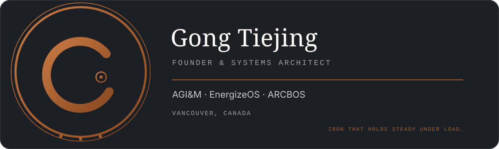

<!--
  Personal profile governed by the Gong Tiejing Personal Visual Identity System v1.0.
  Source of truth: https://enxpower.com/gong-vi/
  Do not recolor, distort, rotate, date, or crowd the seal.
-->

  

<samp>PRECISION · STRUCTURE · CONTINUITY · AUTHORITY</samp>

## Systems that hold under load

I am **Gong Tiejing (Andy Gong)**, a founder and systems architect based in Vancouver, Canada. I build and commercialize intelligent systems across energy infrastructure, industrial controls, autonomous robotics, and technical publishing.

My core work is concentrated in:

- **BMS** — battery management system hardware, software, protection, diagnostics, and system interfaces.
- **EMS** — energy management system architecture, controls, optimization, edge runtime, and supervisory software.
- **BESS** — lithium battery energy storage system integration across electrical, controls, safety, communications, and lifecycle operations.
- **Grid and microgrid applications** — commercial and industrial energy systems, renewable integration, peak management, resilience, and islanded operation.
- **Autonomous outdoor systems** — robotic platforms engineered for severe weather and demanding industrial environments.

## Ventures

<table>
  <tr>
    <td width="33%" valign="top">
      <strong><a href="https://agim.ca">AGI&amp;M</a></strong>  
      Technology investment, commercialization, and cross-border execution for industrial systems.
    </td>
    <td width="33%" valign="top">
      <strong><a href="https://energizeos.com">EnergizeOS</a></strong>  
      Energy management and microgrid intelligence for battery storage and distributed energy systems.
    </td>
    <td width="33%" valign="top">
      <strong><a href="https://arcbos.com">ARCBOS</a></strong>  
      Autonomous robotic systems engineered for extreme outdoor and industrial conditions.
    </td>
  </tr>
</table>

## Engineering approach

<table>
  <tr>
    <td width="25%"><samp>PRECISION</samp> Clear requirements, measurable behavior, controlled interfaces.</td>
    <td width="25%"><samp>STRUCTURE</samp> Architecture that remains understandable as systems grow.</td>
    <td width="25%"><samp>CONTINUITY</samp> Products, documentation, and operations designed to endure.</td>
    <td width="25%"><samp>AUTHORITY</samp> Decisions grounded in engineering evidence and accountability.</td>
  </tr>
</table>

## Current focus

I am currently advancing practical software and hardware systems for **BMS, EMS, lithium BESS, grids, microgrids, and commercial and industrial energy applications**, while developing ARCBOS autonomous outdoor robotics and the infrastructure required to operate these products reliably.

---

  <a href="mailto:andy.gong@agim.ca">andy.gong@agim.ca</a>
  &nbsp;·&nbsp;
  <a href="https://enxpower.com/gong-vi/">Personal VI</a>
  &nbsp;·&nbsp;
  Vancouver, Canada

